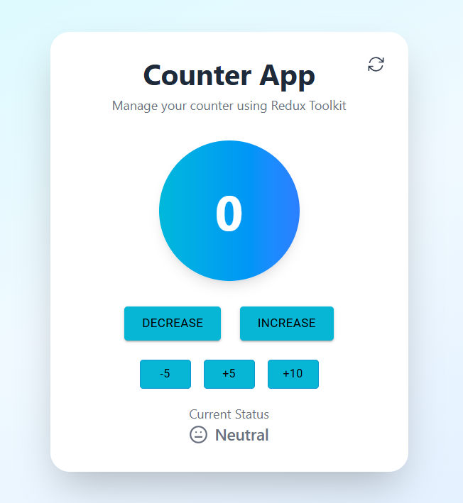

# Redux Counter App

A modern and responsive Counter Application built with React, Redux Toolkit, Tailwind CSS, and Material UI. The application demonstrates state management using Redux Toolkit with a clean and interactive user interface.

## Screenshot



---

## Features

- Increase and decrease the counter
- Increment the counter by custom values (+5 and +10)
- Decrement the counter by 5
- Display counter status (Positive, Negative, or Neutral)
- Refresh button to reset the application
- Responsive and modern user interface
- State management using Redux Toolkit

---

## Technologies Used

- React
- Redux Toolkit
- React Redux
- Tailwind CSS
- Material UI
- Heroicons
- Lucide React
- Vite

---

## Project Structure

```text
redux-counter-app/
│
├── public/
│
├── src/
│   ├── assets/
│   ├── utils/
│   │   └── counter/
│   │       └── counterSlice.js
│   ├── App.jsx
│   ├── index.css
│   ├── main.jsx
│   └── store.js
│
├── .gitignore
├── .oxlintrc.json
├── index.html
├── package.json
├── package-lock.json
├── README.md
├── screenshot.png
└── vite.config.js
```

---

## Installation

Clone the repository:

```bash
git clone https://github.com/Areej39/redux-counter-app.git
```

Navigate to the project directory:

```bash
cd redux-counter-app
```

Install dependencies:

```bash
npm install
```

Start the development server:

```bash
npm run dev
```

---

## Dependencies

- React
- Redux Toolkit
- React Redux
- Tailwind CSS
- Material UI
- Heroicons
- Lucide React
- Vite

---

## Author

**Areej Fatima**

GitHub: https://github.com/Areej39
